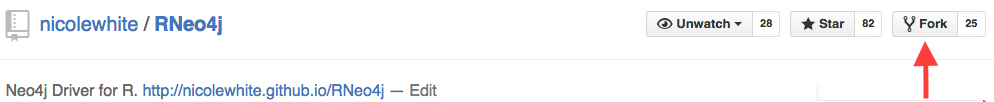
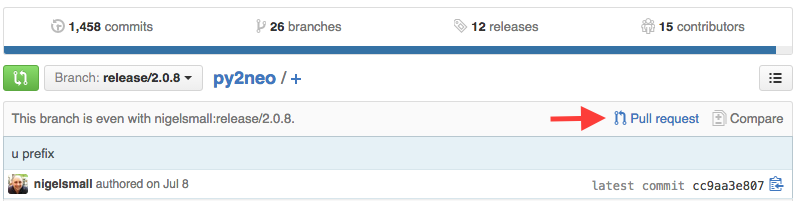

# Contributing

## Dependencies

* [git](https://git-scm.com/downloads)
* [R](https://cran.r-project.org/mirrors.html)
* [RStudio](https://www.rstudio.com/products/rstudio/download/)

## Fork the Project

Fork [my repository](https://github.com/nicolewhite/RNeo4j) with the "Fork" button on GitHub.



## Clone the Project

Clone your fork.

```
$ git clone https://github.com/yourusername/RNeo4j.git
```

In RStudio, `File --> Open Project...` and open the `RNeo4j.Rproj` file.

## R Dependencies

```r
install.packages("httr")
install.packages("RJSONIO")
install.packages("testthat")
```

## Neo4j

Get Neo4j with `make download_neo4j`. This will download the latest release of Neo4j and create a `neo4j` directory in the working directory. Start Neo4j with `make start_neo4j`.

## Contribute Code

### Update the README

If you want to add to or edit the README, make sure you make your changes in `README.Rmd`. This is an [R Markdown](https://www.rstudio.com/wp-content/uploads/2015/02/rmarkdown-cheatsheet.pdf) file, which is converted to `README.md` with `make readme`. Once you've ran `make readme`, you can open the `README.md` file in RStudio and preview it with the "Preview HTML" button at the top.

### Modify Existing Code

If you're modifying existing code, just use `make test` to ensure you haven't broken any existing functionality. If applicable, add some tests.

### Add New Code

If you're adding a new function, add a new file to the `R` directory where the name of the file is the name of the function. Look at the other files in the `R` directory for an example. You'll also need to document your function in the `man` directory by creating an `.Rd` file. I don't use roxygen so you'll have to build this by hand. Of course, you need to add tests for your new function.

## Add Tests

Tests are located in the `tests/testthat` directory. Check out some of the current test files for examples of how to use it. Add tests to any of the existing test files in the `tests` directory or add a new test file for your tests if they don't fit into any of the current test file categories. The filename must be prefixed `test-`.

## Run Tests

Run tests with `make test`. Neo4j must be running in order to run the tests.

## Commit Your Changes

Commit the changes to your fork with a descriptive commit message. [This](https://github.com/nicolewhite/RNeo4j/commit/38acea8eb7e03d1ae3231405ce0b65a8e39f7062) is a good example.

```
$ git commit
```

## Push Your Changes

Push the changes to your fork.

```
$ git push
```

## Open a Pull Request

Go to your fork on GitHub. Click on the "Pull Request" button beneath the title. For example:


