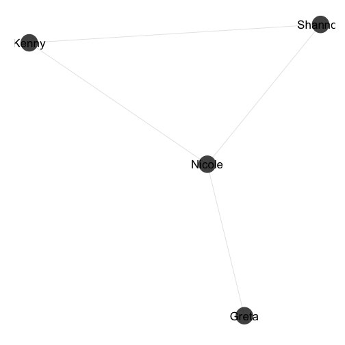
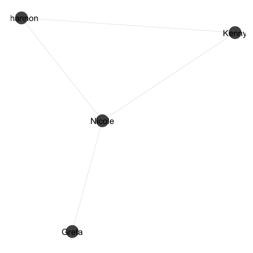

# RNeo4j [](https://travis-ci.org/nicolewhite/RNeo4j)

RNeo4j is Neo4j's R driver. It allows you to read and write data from / to Neo4j directly from your R environment.

## Contents


* [Install](#install)
* [Connect](#connect)
* [Nodes](#nodes)
* [Relationships](#relationships)
* [Cypher](#cypher)
* [Shortest Paths](#shortest-paths)
* [Weighted Shortest Paths](#weighted-shortest-paths)
* [Graph Algorithms](#graph-algorithms)
* [Visualizations](#visualizations)
* [Import](#import)
* [Connection Issues](#connection-issues)
* [Contribute](#contribute)

## <a name="#install"></a>Install

### Neo4j

[Download Neo4j](http://neo4j.com/download/) community edition.

#### Windows

If you're on Windows, just download the `.exe` and follow the instructions. You'll get a GUI where you simply press "Start" to start Neo4j.

#### OS X

If you're on OS X, you can download either the `.dmg` or the `.tar.gz`. The `.dmg` is currently offered under the "beta program." This will give you a GUI where you simply press "Start" to start Neo4j. Otherwise, download the `.tar.gz`, unzip, navigate to the directory and execute `./bin/neo4j start`.

#### Linux

If you're on Linux, you have to use the `.tar.gz`. Download the `.tar.gz`, unzip, navigate to the directory and execute `./bin/neo4j start`.

### RNeo4j

#### From CRAN


```r
install.packages("RNeo4j")
```

#### From GitHub


```r
devtools::install_github("nicolewhite/RNeo4j")
```

#### From Source

Go to the [latest release](https://github.com/nicolewhite/RNeo4j/releases/latest) and download the source code. You can then install with `install.packages`.


```r
install.packages("/path/to/file.tar.gz", repos=NULL, type="source")
```

#### Load the Package


```r
library(RNeo4j)
```

## <a name="#connect"></a>Connect


```r
graph = startGraph("http://localhost:7474/db/data/")
```

If you have authentication enabled, pass your username and password.


```r
graph = startGraph("http://localhost:7474/db/data/", username="neo4j", password="password")
```


## <a name="#nodes"></a>Nodes


```r
nicole = createNode(graph, "Person", name="Nicole", age=24)
greta = createNode(graph, "Person", name="Greta", age=24)
kenny = createNode(graph, "Person", name="Kenny", age=27)
shannon = createNode(graph, "Person", name="Shannon", age=23)
```

## <a name="#relationships"></a>Relationships


```r
r1 = createRel(greta, "LIKES", nicole, weight=7)
r2 = createRel(nicole, "LIKES", kenny, weight=1)
r3 = createRel(kenny, "LIKES", shannon, weight=3)
r4 = createRel(nicole, "LIKES", shannon, weight=5)
```

## <a name="#cypher"></a>Cypher

If you're returning tabular results, use `cypher`, which will give you a `data.frame`.


```r
query = "
MATCH (nicole:Person)-[r:LIKES]->(p:Person)
WHERE nicole.name = 'Nicole'
RETURN nicole.name, r.weight, p.name
"

cypher(graph, query)
```

```
##   nicole.name r.weight  p.name
## 1      Nicole        5 Shannon
## 2      Nicole        1   Kenny
```

For anything more complicated, use `cypherToList`, which will give you a `list`.


```r
query = "
MATCH (nicole:Person)-[:LIKES]->(p:Person)
WHERE nicole.name = 'Nicole'
RETURN nicole, COLLECT(p.name) AS friends
"

cypherToList(graph, query)
```

```
## [[1]]
## [[1]]$nicole
## < Node > 
## Person
## 
## $name
## [1] "Nicole"
## 
## $age
## [1] 24
## 
## 
## [[1]]$friends
## [[1]]$friends[[1]]
## [1] "Shannon"
## 
## [[1]]$friends[[2]]
## [1] "Kenny"
```

Both `cypher` and `cypherToList` accept parameters. These parameters can be passed individually or as a list.


```r
query = "
MATCH (p1:Person)-[r:LIKES]->(p2:Person)
WHERE p1.name = {name1} AND p2.name = {name2}
RETURN p1.name, r.weight, p2.name
"

cypher(graph, query, name1="Nicole", name2="Shannon")
```

```
##   p1.name r.weight p2.name
## 1  Nicole        5 Shannon
```

```r
cypher(graph, query, list(name1="Nicole", name2="Shannon"))
```

```
##   p1.name r.weight p2.name
## 1  Nicole        5 Shannon
```

## <a name="#shortest-paths"></a>Shortest Paths


```r
p = shortestPath(greta, "LIKES", shannon, max_depth=4)
n = nodes(p)
sapply(n, "[[", "name")
```

```
## [1] "Greta"   "Nicole"  "Shannon"
```

## <a name="#weighted-shortest-paths"></a>Weighted Shortest Paths


```r
p = shortestPath(greta, "LIKES", shannon, max_depth=4, cost_property="weight")
n = nodes(p)
sapply(n, "[[", "name")
```

```
## [1] "Greta"   "Nicole"  "Kenny"   "Shannon"
```

```r
p$weight
```

```
## [1] 11
```

## <a name="#cypher"></a>Graph Algorithms


```r
library(igraph)

query = "
MATCH (n)-->(m)
RETURN n.name, m.name
"

edgelist = cypher(graph, query)
ig = graph.data.frame(edgelist, directed=F)

betweenness(ig)
```

```
##  Nicole   Greta   Kenny Shannon 
##       2       0       0       0
```

```r
closeness(ig)
```

```
##    Nicole     Greta     Kenny   Shannon 
## 0.3333333 0.2000000 0.2500000 0.2500000
```

## <a name="#visualizations"></a>Visualizations

### `igraph`


```r
plot(ig)
```

 

### `ggnet`


```r
library(network)
library(GGally)

net = network(edgelist)
ggnet(net, label.nodes=TRUE)
```

 

### `visNetwork`

[Read this blog post](http://nicolewhite.github.io/2015/06/18/visualize-your-graph-with-rneo4j-and-visNetwork.html) and [check out this slide deck](http://nicolewhite.github.io/neo4j-presentations/RNeo4j/Visualizations/Visualizations.html#1).

## <a name="#import"></a>Import


```r
library(hflights)
hflights = hflights[sample(nrow(hflights), 1000), ]
row.names(hflights) = NULL

head(hflights)
```

```
##   Year Month DayofMonth DayOfWeek DepTime ArrTime UniqueCarrier FlightNum
## 1 2011    12          9         5    2059    2313            CO      1615
## 2 2011     8          4         4      NA      NA            MQ      2870
## 3 2011     2         17         4    1057    1416            WN         9
## 4 2011    12         10         6    1325    1628            CO      1151
## 5 2011    11         20         7    1922    2100            XE      4370
## 6 2011    10         25         2    1033    1143            WN       183
##   TailNum ActualElapsedTime AirTime ArrDelay DepDelay Origin Dest Distance
## 1  N14629               194     168       -8       -1    IAH  SLC     1195
## 2  N692MQ                NA      NA       NA       NA    HOU  DFW      247
## 3  N511SW               139     123       36       32    HOU  FLL      957
## 4  N57852               123     102      -18       -5    IAH  MCO      854
## 5  N15948                98      76       64       62    IAH  LBB      458
## 6  N368SW                70      57       -7       -2    HOU  LIT      393
##   TaxiIn TaxiOut Cancelled CancellationCode Diverted
## 1     10      16         0                         0
## 2     NA      NA         1                A        0
## 3      3      13         0                         0
## 4      7      14         0                         0
## 5      5      17         0                         0
## 6      4       9         0                         0
```

```r
addConstraint(graph, "Carrier", "name")
addConstraint(graph, "Airport", "name")

query = "
CREATE (flight:Flight {number: {FlightNum} })
SET flight.year = TOINT({Year}),
    flight.month = TOINT({DayofMonth}),
    flight.day = TOINT({DayOfWeek})

MERGE (carrier:Carrier {name: {UniqueCarrier} })
CREATE (flight)-[:OPERATED_BY]->(carrier)

MERGE (origin:Airport {name: {Origin} })
MERGE (dest:Airport {name: {Dest} })

CREATE (flight)-[o:ORIGIN]->(origin)
CREATE (flight)-[d:DESTINATION]->(dest)

SET o.delay = TOINT({DepDelay}),
    o.taxi_time = TOINT({TaxiOut})

SET d.delay = TOINT({ArrDelay}),
    d.taxi_time = TOINT({TaxiIn})
"

tx = newTransaction(graph)

for(i in 1:nrow(hflights)) {
  row = hflights[i, ]
  
  appendCypher(tx, query,
               FlightNum=row$FlightNum,
               Year=row$Year,
               DayofMonth=row$DayofMonth,
               DayOfWeek=row$DayOfWeek,
               UniqueCarrier=row$UniqueCarrier,
               Origin=row$Origin,
               Dest=row$Dest,
               DepDelay=row$DepDelay,
               TaxiOut=row$TaxiOut,
               ArrDelay=row$ArrDelay,
               TaxiIn=row$TaxiIn)
}

commit(tx)

summary(graph)
```

```
##     This          To    That
## 1 Flight OPERATED_BY Carrier
## 2 Flight      ORIGIN Airport
## 3 Flight DESTINATION Airport
```

## <a name="#connection-issues"></a>Connection Issues

### Couldn't connect to server
```
Error in curl::curl_fetch_memory(url, handle = handle) : 
  Couldn't connect to server
```

Neo4j probably isn't running. Make sure Neo4j is running first. It's also possible you have localhost resolution issues; try connecting to `http://127.0.0.1:7474/db/data/` instead.

### No authorization header supplied

```
Error: client error: (401) Unauthorized
Neo.ClientError.Security.AuthorizationFailed
No authorization header supplied.
```

You have auth enabled on Neo4j and either didn't provide your username and password or they were invalid. You can pass a username and password to `startGraph`.

```
graph = startGraph("http://localhost:7474/db/data/", username="neo4j", password="password")
```

You can also disable auth by editing the following line in `conf/neo4j-server.properties`.

```
# Require (or disable the requirement of) auth to access Neo4j
dbms.security.auth_enabled=false
```

## <a name="#contribute"></a>Contribute

Check out [the contributing doc](https://github.com/nicolewhite/RNeo4j/blob/master/CONTRIBUTING.md) if you'd like to contribute!
