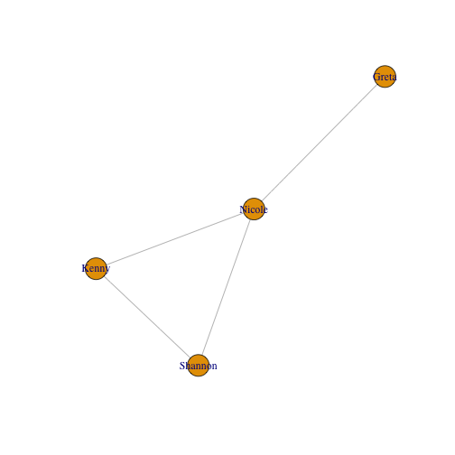
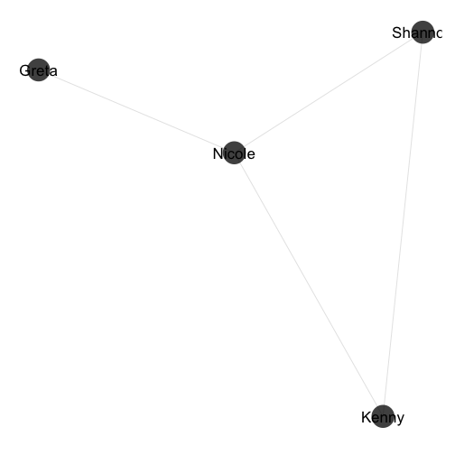

# RNeo4j [](https://travis-ci.org/nicolewhite/RNeo4j)

RNeo4j is Neo4j's R driver. It allows you to read and write data from / to Neo4j directly from your R environment.

## Contents

* [Install](#install)
* [Connect](#connect)
* [Nodes](#nodes)
* [Relationships](#relationships)
* [Cypher](#cypher)
* [Shortest Paths](#shortest-paths)
* [Weighted Shortest Paths](#weighted-shortest-paths)
* [Graph Algorithms](#graph-algorithms)
* [Visualizations](#visualizations)
* [Import](#import)
* [Connection Issues](#connection-issues)

## <a name="#install"></a>Install


```r
install.packages("devtools")
devtools::install_github("nicolewhite/RNeo4j")
library(RNeo4j)
```


## <a name="#connect"></a>Connect


```r
graph = startGraph("http://localhost:7474/db/data/")
```


## <a name="#nodes"></a>Nodes


```r
nicole = createNode(graph, "Person", name="Nicole", age=24)
greta = createNode(graph, "Person", name="Greta", age=24)
kenny = createNode(graph, "Person", name="Kenny", age=27)
shannon = createNode(graph, "Person", name="Shannon", age=23)
```

## <a name="#relationships"></a>Relationships


```r
r1 = createRel(greta, "LIKES", nicole, weight=7)
r2 = createRel(nicole, "LIKES", kenny, weight=1)
r3 = createRel(kenny, "LIKES", shannon, weight=3)
r4 = createRel(nicole, "LIKES", shannon, weight=5)
```

## <a name="#cypher"></a>Cypher

If you're returning tabular results, use `cypher`, which will give you a `data.frame`.


```r
query = "
MATCH (nicole:Person)-[r:LIKES]->(p:Person)
WHERE nicole.name = 'Nicole'
RETURN nicole.name, r.weight, p.name
"

cypher(graph, query)
```

```
##   nicole.name r.weight  p.name
## 1      Nicole        5 Shannon
## 2      Nicole        1   Kenny
```

For anything more complicated, use `cypherToList`, which will give you a `list`.


```r
query = "
MATCH (nicole:Person)-[:LIKES]->(p:Person)
WHERE nicole.name = 'Nicole'
RETURN nicole, COLLECT(p.name) AS friends
"

cypherToList(graph, query)
```

```
## [[1]]
## [[1]]$nicole
## < Node Object > 
## $name
## [1] "Nicole"
## 
## $age
## [1] 24
## 
## 
## [[1]]$friends
## [[1]]$friends[[1]]
## [1] "Shannon"
## 
## [[1]]$friends[[2]]
## [1] "Kenny"
```

Both `cypher` and `cypherToList` accept parameters. These parameters can be passed individually or as a list.


```r
query = "
MATCH (p1:Person)-[r:LIKES]->(p2:Person)
WHERE p1.name = {name1} AND p2.name = {name2}
RETURN p1.name, r.weight, p2.name
"

cypher(graph, query, name1="Nicole", name2="Shannon")
```

```
##   p1.name r.weight p2.name
## 1  Nicole        5 Shannon
```

```r
cypher(graph, query, list(name1="Nicole", name2="Shannon"))
```

```
##   p1.name r.weight p2.name
## 1  Nicole        5 Shannon
```

## <a name="#shortest-paths"></a>Shortest Paths


```r
p = shortestPath(greta, "LIKES", shannon, max_depth=4)
n = nodes(p)
sapply(n, "[[", "name")
```

```
## [1] "Greta"   "Nicole"  "Shannon"
```

## <a name="#weighted-shortest-paths"></a>Weighted Shortest Paths


```r
p = shortestPath(greta, "LIKES", shannon, max_depth=4, cost_property="weight")
n = nodes(p)
sapply(n, "[[", "name")
```

```
## [1] "Greta"   "Nicole"  "Kenny"   "Shannon"
```

```r
p$weight
```

```
## [1] 11
```

## <a name="#cypher"></a>Graph Algorithms


```r
library(igraph)

query = "
MATCH (n)-->(m)
RETURN n.name, m.name
"

edgelist = cypher(graph, query)
ig = graph.data.frame(edgelist, directed=F)

betweenness(ig)
```

```
##  Nicole   Greta   Kenny Shannon 
##       2       0       0       0
```

```r
closeness(ig)
```

```
##    Nicole     Greta     Kenny   Shannon 
## 0.3333333 0.2000000 0.2500000 0.2500000
```

## <a name="#visualizations"></a>Visualizations

### `igraph`


```r
plot(ig)
```

 

### `ggnet`


```r
library(network)
library(GGally)

net = network(edgelist)
ggnet(net, label.nodes=TRUE)
```

 

### `visNetwork`

[Read this blog post](http://nicolewhite.github.io/2015/06/18/visualize-your-graph-with-rneo4j-and-visNetwork.html).

## <a name="#import"></a>Import


```r
library(hflights)
hflights = hflights[sample(nrow(hflights), 1000), ]

head(hflights)
```

```
##         Year Month DayofMonth DayOfWeek DepTime ArrTime UniqueCarrier
## 1689355 2011     4         27         3     752    1059            XE
## 5667091 2011    12         28         3    1912    2306            CO
## 3803236 2011     8          5         5     715    1054            XE
## 1187449 2011     3         13         7    1948    2056            MQ
## 4819114 2011    10         19         3    2123    2225            XE
## 3896065 2011     8         18         4    2110    2241            OO
##         FlightNum TailNum ActualElapsedTime AirTime ArrDelay DepDelay
## 1689355      2435  N18982               127     102       -3       -8
## 5667091      1235  N76269               174     143        4        2
## 3803236      2240  N11187               159     140        0        0
## 1187449      3328  N641MQ                68      50        6        8
## 4819114      4216  N14920                62      39        4        3
## 3896065      5844  N907SW                91      64        6       -5
##         Origin Dest Distance TaxiIn TaxiOut Cancelled CancellationCode
## 1689355    IAH  JAX      817      7      18         0                 
## 5667091    IAH  DTW     1075      5      26         0                 
## 3803236    IAH  RDU     1042     11       8         0                 
## 1187449    HOU  DFW      247      8      10         0                 
## 4819114    IAH  BTR      253      7      16         0                 
## 3896065    IAH  MAF      429      3      24         0                 
##         Diverted
## 1689355        0
## 5667091        0
## 3803236        0
## 1187449        0
## 4819114        0
## 3896065        0
```

```r
addConstraint(graph, "Carrier", "name")
addConstraint(graph, "Airport", "name")

query = "
CREATE (flight:Flight {number: {FlightNum} })
SET flight.year = TOINT({Year}),
    flight.month = TOINT({DayofMonth}),
    flight.day = TOINT({DayOfWeek})

MERGE (carrier:Carrier {name: {UniqueCarrier} })
CREATE (flight)-[:OPERATED_BY]->(carrier)

MERGE (origin:Airport {name: {Origin} })
MERGE (dest:Airport {name: {Dest} })

CREATE (flight)-[o:ORIGIN]->(origin)
CREATE (flight)-[d:DESTINATION]->(dest)

SET o.delay = TOINT({DepDelay}),
    o.taxi_time = TOINT({TaxiOut})

SET d.delay = TOINT({ArrDelay}),
    d.taxi_time = TOINT({TaxiIn})
"

tx = newTransaction(graph)

for(i in 1:nrow(hflights)) {
  row = hflights[i, ]
  
  appendCypher(tx, query,
               FlightNum=row$FlightNum,
               Year=row$Year,
               DayofMonth=row$DayofMonth,
               DayOfWeek=row$DayOfWeek,
               UniqueCarrier=row$UniqueCarrier,
               Origin=row$Origin,
               Dest=row$Dest,
               DepDelay=row$DepDelay,
               TaxiOut=row$TaxiOut,
               ArrDelay=row$ArrDelay,
               TaxiIn=row$TaxiIn)
}

commit(tx)

summary(graph)
```

```
##     This          To    That
## 1 Flight OPERATED_BY Carrier
## 2 Flight      ORIGIN Airport
## 3 Flight DESTINATION Airport
```

## <a name="#connection-issues"></a>Connection Issues

### Couldn't connect to server
```
Error in curl::curl_fetch_memory(url, handle = handle) : 
  Couldn't connect to server
```

Neo4j probably isn't running. Make sure Neo4j is running first. It's also possible you have localhost resolution issues; try connecting to `http://127.0.0.1:7474/db/data/` instead.

### No authorization header supplied

```
Error: client error: (401) Unauthorized
Neo.ClientError.Security.AuthorizationFailed
No authorization header supplied.
```

You have auth enabled on Neo4j and either didn't provide your username and password or they were invalid. You can pass a username and password to `startGraph`.

```
graph = startGraph("http://localhost:7474/db/data/", username="neo4j", password="password")
```

You can also disable auth by editing the following line in `conf/neo4j-server.properties`.

```
# Require (or disable the requirement of) auth to access Neo4j
dbms.security.auth_enabled=false
```
